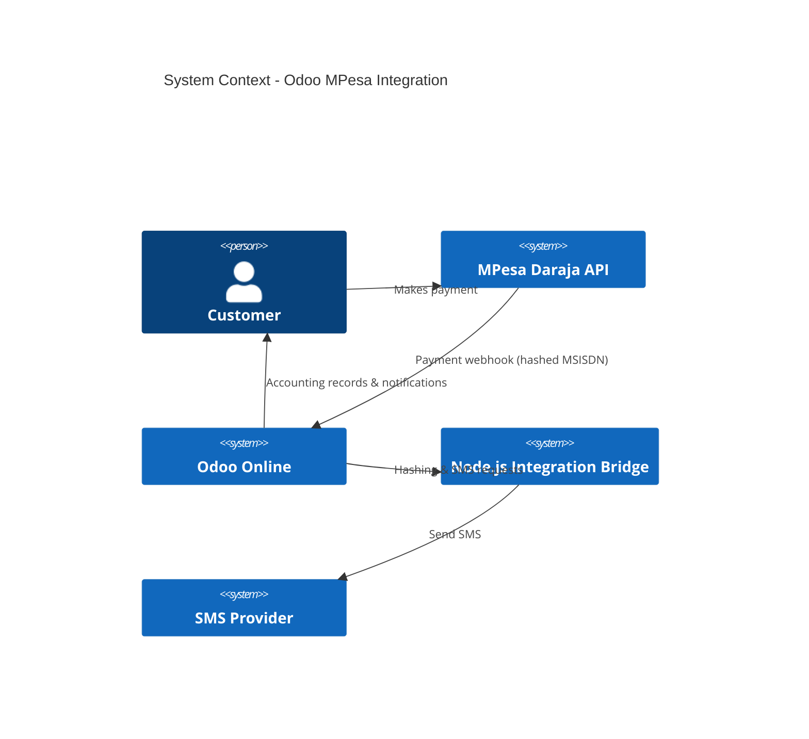

# Architecture & System Design

This document describes the internal architecture, design decisions, and system interactions for the Odoo MPesa Payments & SMS Integration Bridge.

---

## 1. Design Constraints

### Odoo Online Limitations

- No external Python libraries
- No cryptographic functions
- Sandboxed execution
- HTTP requests only

### MPesa Constraints

- MSISDN sent as SHA256 hash
- No plaintext phone number
- Webhook-driven confirmations

---

## 2. Architectural Pattern

**Adapter / Integration Bridge Pattern**

- Odoo remains the system of record
- Node.js acts as a stateless utility service
- External providers remain decoupled

---

## 3. C4 Model Diagrams

---

### 3.1 C4 – System Context Diagram

