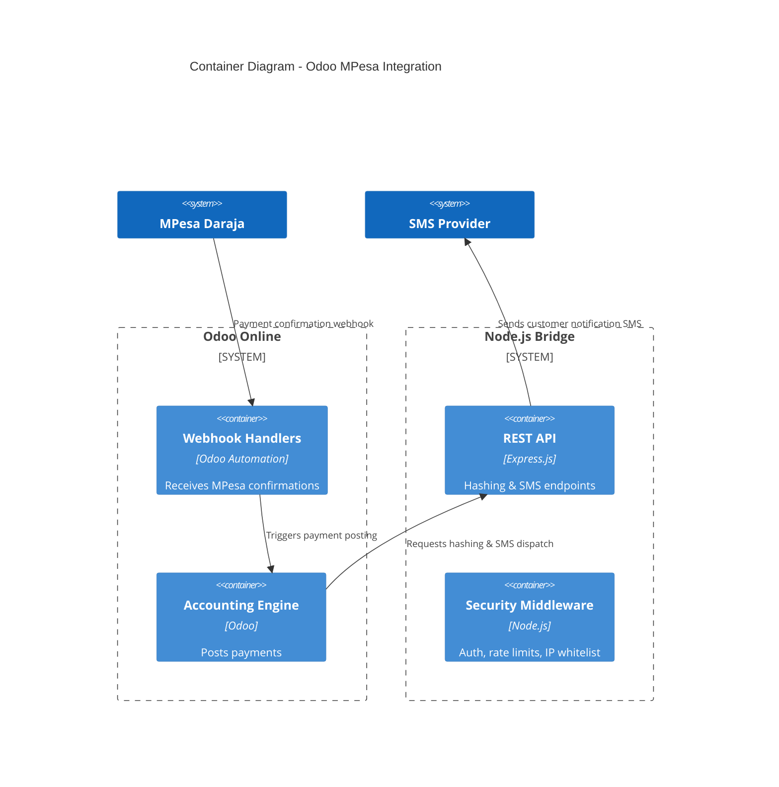

```mermaid
C4Container
title Container Diagram - Odoo MPesa Integration

System_Boundary(OdooBoundary, "Odoo Online") {
Container(Webhooks, "Webhook Handlers", "Odoo Automation", "Receives MPesa confirmations")
Container(Accounting, "Accounting Engine", "Odoo", "Posts payments")
}

System_Boundary(NodeBoundary, "Node.js Bridge") {
Container(API, "REST API", "Express.js", "Hashing & SMS endpoints")
Container(Security, "Security Middleware", "Node.js", "Auth, rate limits, IP whitelist")
}

System(MPesa, "MPesa Daraja")
System(SMS, "SMS Provider")

Rel(MPesa, Webhooks, "Payment confirmation webhook")
Rel(Webhooks, Accounting, "Triggers payment posting")
Rel(Accounting, API, "Requests hashing & SMS dispatch")
Rel(API, SMS, "Sends customer notification SMS")
```
