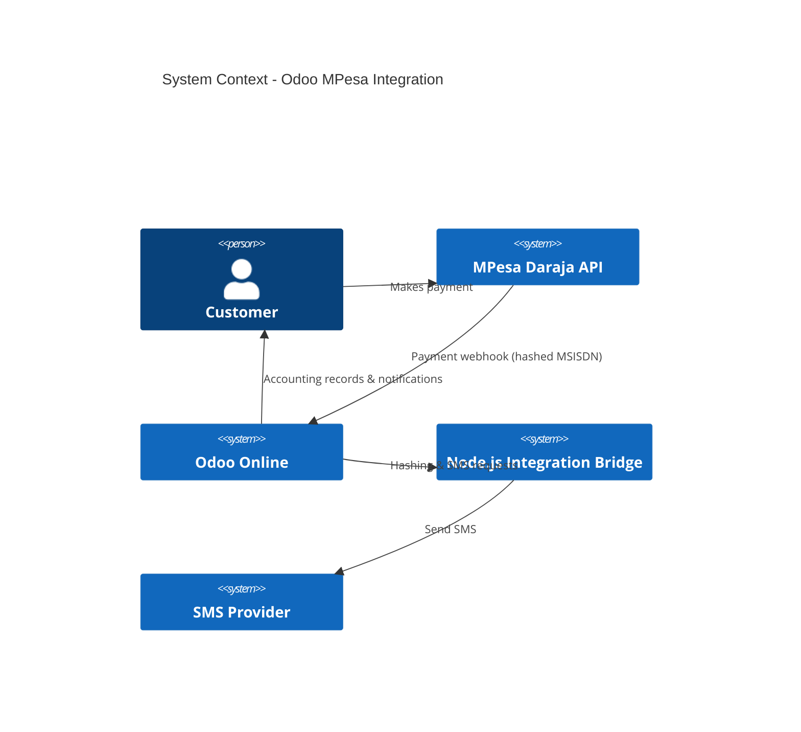

```mermaid
C4Context
title System Context - Odoo MPesa Integration

Person(Customer, "Customer")
System(MPesa, "MPesa Daraja API")
System(Odoo, "Odoo Online")
System(NodeJS, "Node.js Integration Bridge")
System(SMS, "SMS Provider")

Rel(Customer, MPesa, "Makes payment")
Rel(MPesa, Odoo, "Payment webhook (hashed MSISDN)")
Rel(Odoo, NodeJS, "Hashing & SMS requests")
Rel(NodeJS, SMS, "Send SMS")
Rel(Odoo, Customer, "Accounting records & notifications")
```
