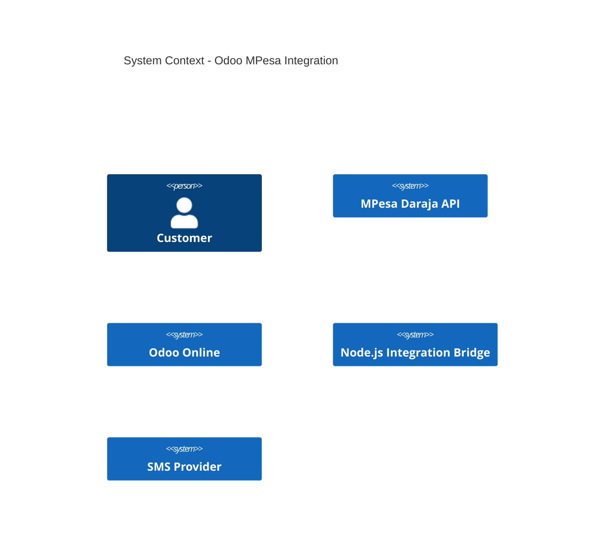

Customer -> MPesa : Makes payment
MPesa -> Odoo : Payment webhook (hashed MSISDN)
Odoo -> NodeJS : Hashing / SMS requests
NodeJS -> SMS : Send SMS
Odoo -> Customer : Accounting records & notifications
